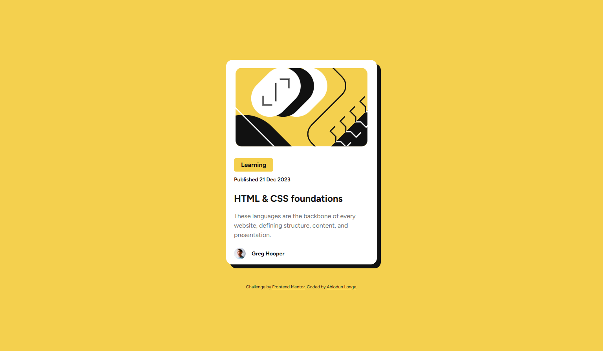

# Frontend Mentor - Blog preview card solution

This is a solution to the [Blog preview card challenge on Frontend Mentor](https://www.frontendmentor.io/challenges/blog-preview-card-ckPaj01IcS). Frontend Mentor challenges help you improve your coding skills by building realistic projects. 

## Table of contents

- [Overview](#overview)
  - [The challenge](#the-challenge)
  - [Screenshot](#screenshot)
  - [Links](#links)
- [My process](#my-process)
  - [Built with](#built-with)
  - [What I learned](#what-i-learned)
  - [Continued development](#continued-development)
  - [Useful resources](#useful-resources)
- [Author](#author)

## Overview

### The challenge

Users should be able to:

- See hover and focus states for all interactive elements on the page

### Screenshot



### Links

- Solution [here](https://github.com/odunlemi/preview-card)
- Live Site [here](https://odunlemi.github.io/preview-card/)

## My process

### Built with

- Semantic HTML5 markup
- CSS custom properties
- Flexbox
<!-- - Mobile-first workflow -->

### What I learned

I had to chance to practice writing a properly structured stylesheet with this challenge. I started with structuring my HTML page (though I used a `section` tag as the main wrapper, didn't want to directly style the body with flex, just base styles). I worked with design file on Figma, images and got to try using local fonts files with `@font-face` but ended using an import. I also will implement a media query for responsiveness on smaller screens.

To see how you can add code snippets, see below:

```css
/* Base styles used */
body {
    font-family: 'Figtree', sans-serif;
    line-height: 1.5;
}
```
```css
.content h1 a:hover {
    color: hsl(47, 88%, 63%);
    cursor: pointer;
}
```
```css
/* Media query */
@media screen and (max-width: 600px) {
  /* Styles for mobile or smaller screens */
}
```

### Continued development

1. ~~Small screen responsiveness with media queries~~ Now done

### Useful resources

- [CSS box-shadow Property
](https://www.w3schools.com/cssref/css3_pr_box-shadow.php)- W3 Schools
<!-- - [CSS Media Queries Guide](https://css-tricks.com/a-complete-guide-to-css-media-queries/) by CSS-Tricks -->

## Author

- Website - [Abiodun Longe](https://www.your-site.com)
- Frontend Mentor - [@odunlemi](https://www.frontendmentor.io/profile/odunlemi)
- X - [@odunlemi](https://www.x.com/odunlemi)
